<!-- ===========================================================
     barongartner/barongartner — GitHub profile README
     Concept: "Specimen". A foundry specimen sheet set in the
     system stack, which is the only type a GitHub README can
     render. Every plate is an SVG in /graphics, in a light and
     a dark cut, drawn on transparent ground; <picture> serves
     the cut that matches the reader's system setting.

     TAGLINE: it is the 16px mono <text> inside the dashed frame in
     graphics/masthead-light.svg and graphics/masthead-dark.svg.
     Edit both cuts.

     VERSIONS: each app plate's version lives in its own
     <text data-repo="Photon">. .github/workflows/refresh-versions.yml
     runs tools/refresh-versions.mjs daily, reads the latest
     release tag from the GitHub API and rewrites it in place.
     Remove data-repo to opt a plate out (The Pit has none).

     Full system notes are in SPEC.md.
     =========================================================== -->
<picture>
    <source media="(prefers-color-scheme: dark)" srcset="graphics/masthead-dark.svg">
    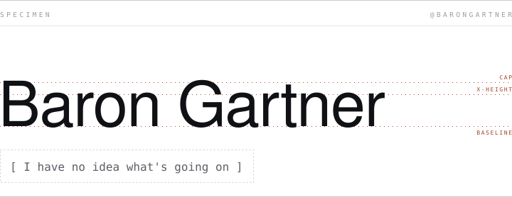
  </picture>

<picture>
    <source media="(prefers-color-scheme: dark)" srcset="graphics/building-dark.svg">
    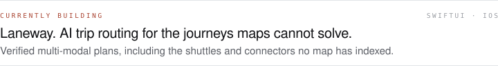
  </picture>

<picture>
    <source media="(prefers-color-scheme: dark)" srcset="graphics/section-software-dark.svg">
    
  </picture>

<a href="https://github.com/barongartner/Photon">
  <picture>
    <source media="(prefers-color-scheme: dark)" srcset="graphics/app-photon-dark.svg">
    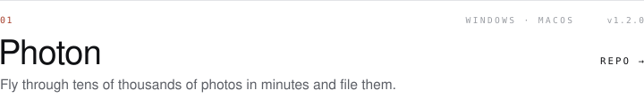
  </picture>
</a>

<a href="https://github.com/barongartner/TrackForge">
  <picture>
    <source media="(prefers-color-scheme: dark)" srcset="graphics/app-trackforge-dark.svg">
    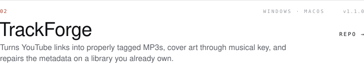
  </picture>
</a>

<a href="https://github.com/barongartner/Verbatim">
  <picture>
    <source media="(prefers-color-scheme: dark)" srcset="graphics/app-verbatim-dark.svg">
    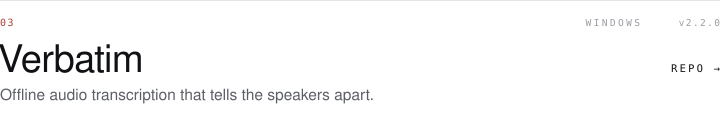
  </picture>
</a>

<a href="https://github.com/barongartner/FreeFlow">
  <picture>
    <source media="(prefers-color-scheme: dark)" srcset="graphics/app-freeflow-dark.svg">
    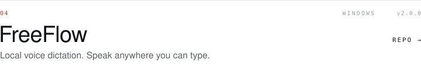
  </picture>
</a>

<a href="https://github.com/barongartner/FreeVoice">
  <picture>
    <source media="(prefers-color-scheme: dark)" srcset="graphics/app-freevoice-dark.svg">
    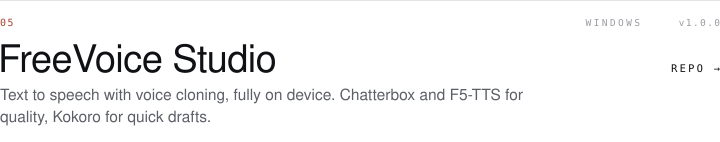
  </picture>
</a>

<a href="https://github.com/barongartner/Split">
  <picture>
    <source media="(prefers-color-scheme: dark)" srcset="graphics/app-split-dark.svg">
    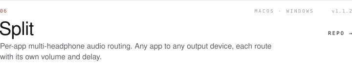
  </picture>
</a>

<a href="https://github.com/barongartner/ReType">
  <picture>
    <source media="(prefers-color-scheme: dark)" srcset="graphics/app-retype-dark.svg">
    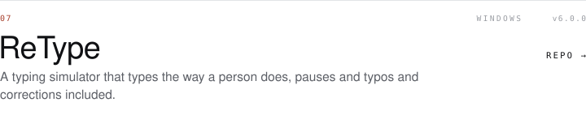
  </picture>
</a>

</a>

## Under Construction
<a href="https://barongartner.github.io">
  <picture>
    <source media="(prefers-color-scheme: dark)" srcset="graphics/downloads-dark.svg">
    
  </picture>
</a>

<picture>
    <source media="(prefers-color-scheme: dark)" srcset="graphics/section-ai-dark.svg">
    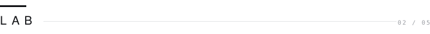
  </picture>

<a href="https://github.com/barongartner/The-Pit">
  <picture>
    <source media="(prefers-color-scheme: dark)" srcset="graphics/app-thepit-dark.svg">
    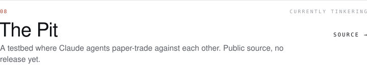
  </picture>
</a>

<picture>
    <source media="(prefers-color-scheme: dark)" srcset="graphics/section-stack-dark.svg">
    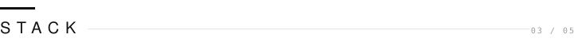
  </picture>

| <picture><source media="(prefers-color-scheme: dark)" srcset="graphics/stack-languages-dark.svg">
|:--|
|   " srcset="graphics/stack-frameworks-dark.svg">
|:--|
|   " srcset="graphics/stack-ai-dark.svg"></picture>
|:--|
|  " srcset="graphics/stack-platforms-dark.svg">
|:--|
|    " srcset="graphics/section-elsewhere-dark.svg">
    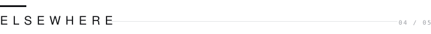
  </picture>

<a href="https://instagram.com/barongartner">
  <picture>
    <source media="(prefers-color-scheme: dark)" srcset="graphics/social-instagram-dark.svg">
    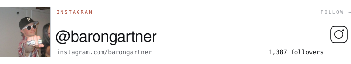
  </picture>
</a>

<a href="https://youtube.com/@barongartner">
  <picture>
    <source media="(prefers-color-scheme: dark)" srcset="graphics/social-youtube-dark.svg">
    
  </picture>
</a>

<picture>
    <source media="(prefers-color-scheme: dark)" srcset="graphics/section-contact-dark.svg">
    
  </picture>

<a href="mailto:barongartner@gmail.com">
  <picture>
    <source media="(prefers-color-scheme: dark)" srcset="graphics/colophon-dark.svg">
    
  </picture>
</a>
