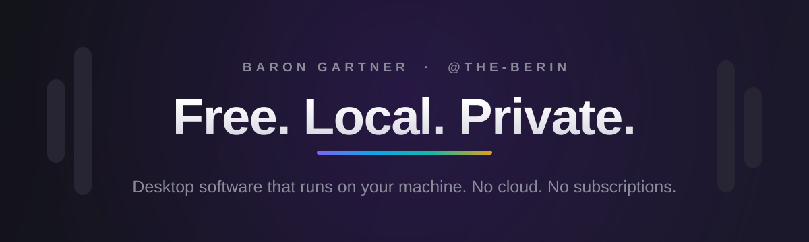
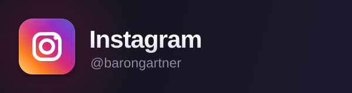

### Hey, I'm Baron 👋

I build **free, local, private** desktop software — apps that run entirely on your machine. No cloud, no accounts, no subscriptions, no telemetry. Mostly **C#** for Windows, with a little **Python**.

 

## 🎙️ The Free suite &nbsp;·&nbsp; private voice, fully on-device

## 🧰 More tools

 

## 🛠️ Built with

 

## 📊 GitHub

 

## 🔗 Find me

 

Everything above is free and runs locally. If that's your thing too, star a repo and dig in. 🖤
